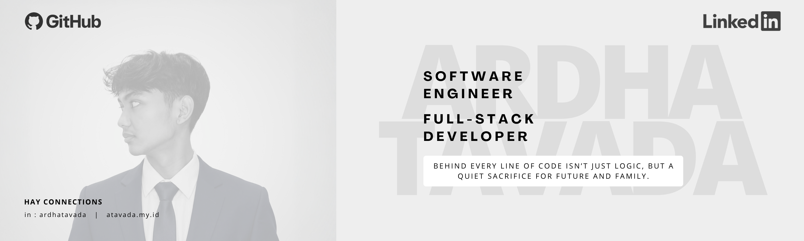
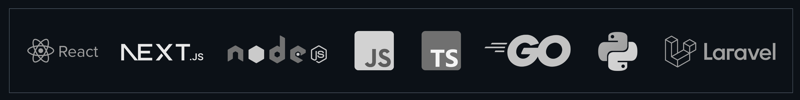

# Hello There!

<table>
  <tr>
    <td valign="top">
      

        I am Ardha Tavada, a Software Developer focused on engineering high-performance, user-centric web applications.
      

      

        I believe in keeping chaos at bay through clean code, precision, and modular component architecture. Specializing in the React and Next.js ecosystem with robust REST API integration, my goal is to build scalable, reliable digital experiences that ensure maximum performance and seamless usability.
      

      
<i>"Dengan nama Allah, Yang Maha Pengasih, lagi Maha Penyayang."</i>

    </td>
    <td width="30"></td>
    <td valign="top" width="280">
      
    </td>
  </tr>
</table>

<!-- > [!NOTE]
> Currently I'm working developing for **[coming soon](url)** -->

  

<h2 align="center">Let's Connects Buddy!</h2>

  
  
  

  

